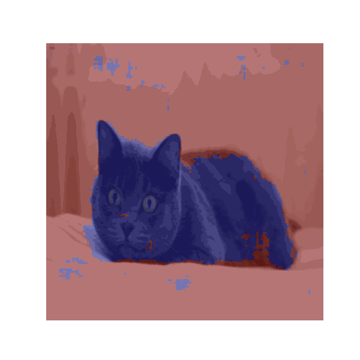

# Oxford-Pets-Segmentation
Проект реализует семантическую сегментацию животных на изображениях из датасета Oxford-IIIT Pets. Модель U-Net обучается отделять животное от фона, используя аннотации масок.


## Пример предсказания


| Example | Project Description |
|-----|------------|
|  | This project implements **multi-class semantic segmentation** of animals from the Oxford-IIIT Pets dataset.<br><br><br>**Goals:**<br><br><br>- Learn and apply the U-Net architecture for multi-class segmentation.<br>- Gain hands-on experience working with images and masks.<br>- Visualize model predictions with overlays 
 


**Project Goals**
- Learn and apply the U-Net architecture for multi-class segmentation.
- Gain hands-on experience working with images and masks.
- Visualize model predictions with overlays 

**Metrics**
- Validation Dice Score: ~ 0.89

**Model Download**
- https://drive.google.com/file/d/1xhuBg5zvdtYcTmorcI9HSFXmFLkBvpTC/view?usp=share_link

## Visualization Demo

```python
from src.dataset import OxfordPetsMultiClassDataset
from src.model import UNetMultiClass
from src.visualize import visualize_predictions_multiclass
import torch

# Setup device
device = torch.device("cuda" if torch.cuda.is_available() else "cpu")

# Load the model
model = UNetMultiClass(n_channels=3, n_classes=3).to(device)
checkpoint = torch.load("outputs/best_model_multiclass.pth", map_location=device)
model.load_state_dict(checkpoint["model_state_dict"])

# Load the dataset
dataset = OxfordPetsMultiClassDataset(root="oxford_pets")

# Visualize 5 sample predictions
visualize_predictions_multiclass(model, dataset, device, num_samples=5)
