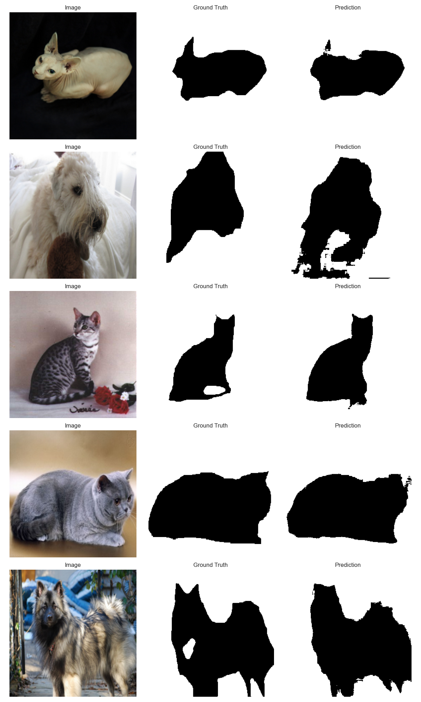

# Oxford-Pets-Segmentation
Проект реализует семантическую сегментацию животных на изображениях из датасета Oxford-IIIT Pets. Модель U-Net обучается отделять животное от фона, используя аннотации масок.


## Пример предсказания



## Описание проекта
Проект реализует семантическую сегментацию животных на изображениях из датасета [Oxford-IIIT Pets](https://www.robots.ox.ac.uk/~vgg/data/pets/).  
Модель **U-Net** обучается отделять животное от фона, используя аннотации масок.  

**Цели проекта**
- Изучение и применение архитектуры U-Net для семантической сегментации.  
- Практика работы с изображениями и масками.  
- Визуализация предсказаний модели и сохранение overlay изображений.  

**Метрики**
- Валидирующий Dice Score: ~0.94

**Ссылка на модель**
- https://drive.google.com/file/d/1RzD1GAVq9mhXxRPkIFX-KoS4YMvOGdpt/view?usp=share_link

## Пример использования

```python
from src.dataset import OxfordPetsDataset
from src.model import UNet
from src.visualize import visualize_predictions
import torch

# Настройка устройства
device = torch.device("cuda" if torch.cuda.is_available() else "cpu")

# Загружаем модель
model = UNet().to(device)
checkpoint = torch.load("outputs/best_model.pth", map_location=device)
model.load_state_dict(checkpoint["model_state_dict"])

# Загружаем датасет
dataset = OxfordPetsDataset(root="oxford_pets")

# Визуализируем 5 примеров предсказаний
visualize_predictions(model, dataset, device, num_samples=5)
